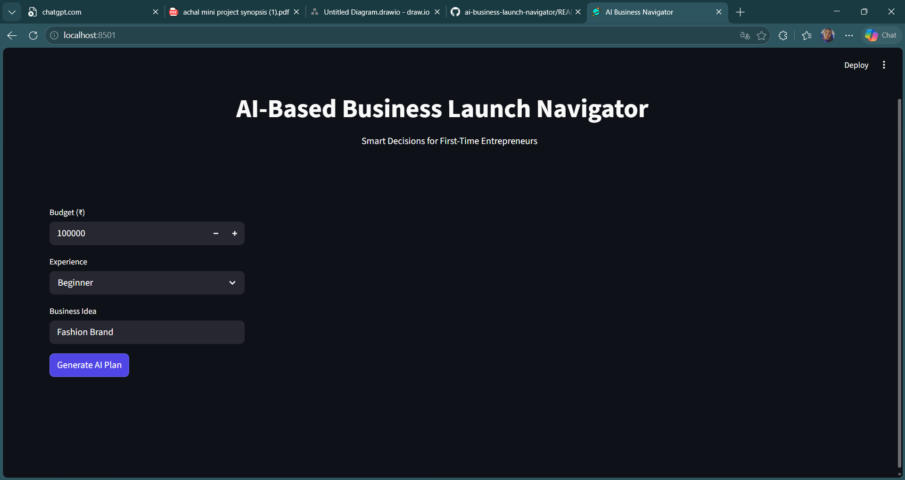
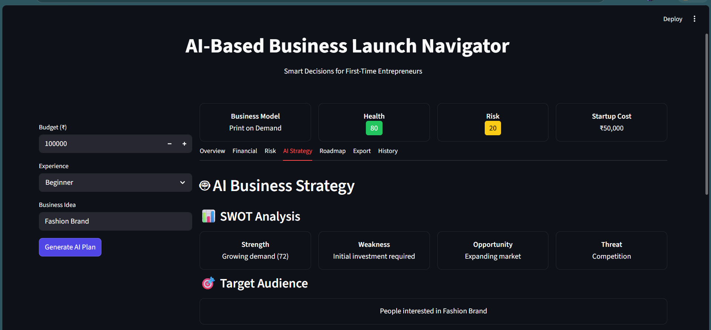
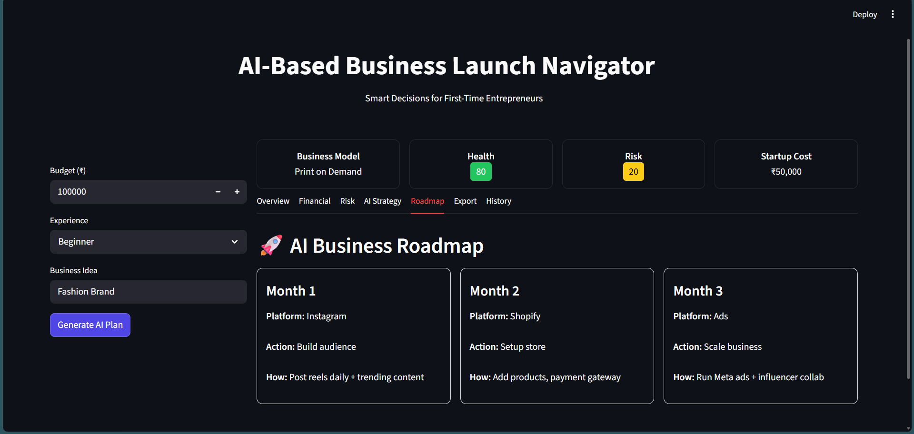
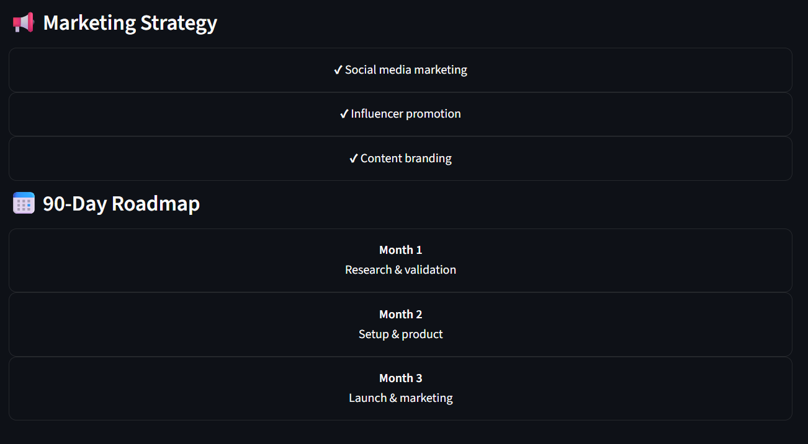
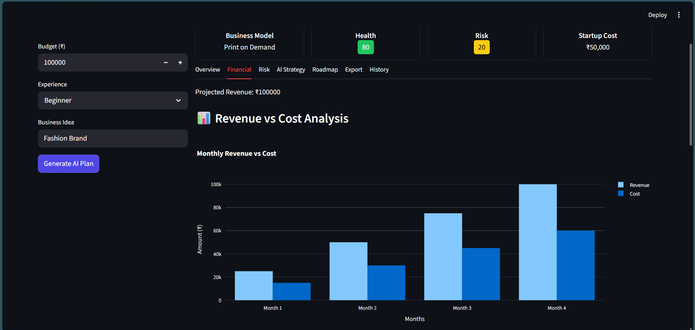
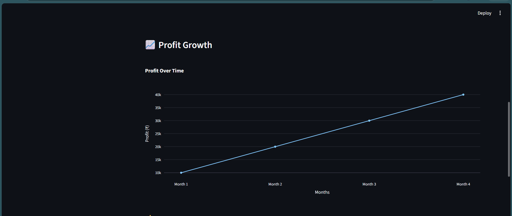
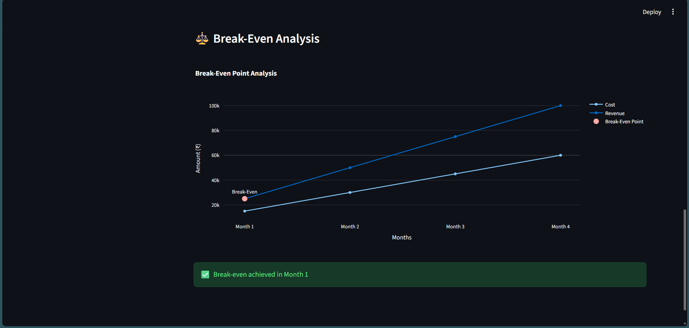
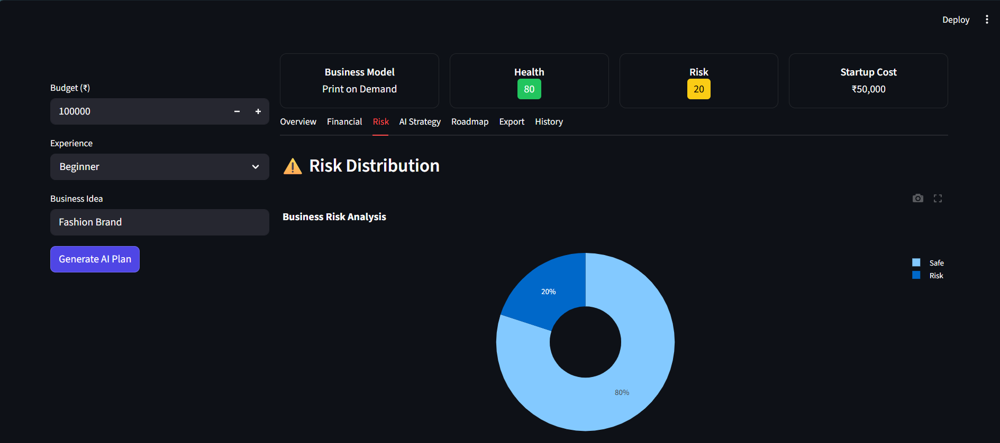
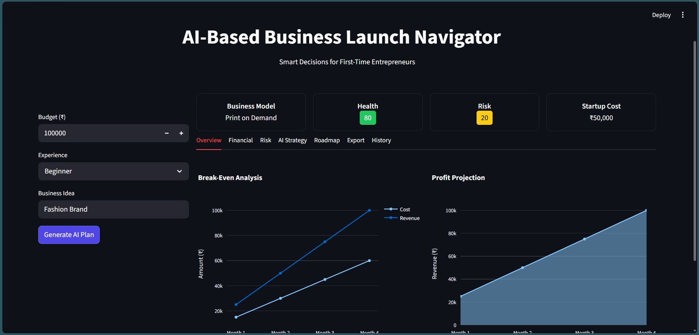

# 🚀 AI Business Launch Navigator

An AI-powered decision support system designed to help beginner entrepreneurs plan and launch small-scale e-commerce businesses with data-driven insights.

---

## 📌 Project Overview

The **AI Business Launch Navigator** is a smart web application that assists users in making informed business decisions. It analyzes user inputs such as budget, experience level, and risk appetite to generate:

- Business model recommendations  
- Startup cost estimation  
- Break-even analysis  
- Profit projections  
- Risk assessment  
- Business roadmap  

This system helps reduce uncertainty and improves planning for first-time entrepreneurs.

---

## ✨ Features

✅ AI-based business model recommendation  
✅ Financial analysis (cost, profit, break-even)  
✅ Risk assessment & health score  
✅ Step-by-step business roadmap  
✅ Interactive dashboard with charts  
✅ Report generation (PDF)  
✅ Data storage using SQLite  

---

## 🧠 Technologies Used

- **Frontend:** Streamlit  
- **Backend:** Python  
- **Machine Learning:** Scikit-learn  
- **Data Processing:** Pandas, NumPy  
- **Visualization:** Plotly  
- **Database:** SQLite  
- **External APIs:** PyTrends, OpenAI  
- **PDF Generation:** ReportLab  

---

## ⚙️ How It Works

1. User enters:
   - Budget  
   - Experience level  
   - Risk appetite  
   - Business idea  

2. System processes input using:
   - AI Decision Engine  
   - Machine Learning Model  

3. Financial module calculates:
   - Cost  
   - Revenue  
   - Profit  

4. Risk module evaluates:
   - Business feasibility  
   - Risk score  

5. Output displayed as:
   - Dashboard  
   - Charts  
   - Business roadmap  

---

## 📂 Project Structure
```
ai-business-launch-navigator/
│
├── app.py # Main Streamlit application
├── database.py # Database operations
├── risk.py # Risk analysis logic
├── roadmap.py # Roadmap generation
├── model.pkl # Machine Learning model (if used)
├── requirements.txt # Dependencies
├── database.db # SQLite database
```

---

## 🚀 Run Locally

```bash
git clone https://github.com/Achal112/ai-business-launch-navigator.git
cd ai-business-launch-navigator

pip install -r requirements.txt
streamlit run app.py
```

## 🌐 Deployment

The application is deployed using Streamlit Cloud.

### 🔗 Live App: (Add your deployed link here)

### 🔑 Environment Variables

Create a .streamlit/secrets.toml file and add:

```bash
OPENAI_API_KEY = "your_api_key_here"
```
--- 

## 📊 Screenshots

* User Input Page


* AI Recommendation Output




* Financial Dashboard



  
* Risk Analysis



* Final Report


## 📌 Use Case

This project is useful for:

* Students learning AI & ML
* Beginner entrepreneurs
* Startup planning
* Academic projects

---

## ⚠️ Limitations

* Depends on user input accuracy
* No real-time market data
* Prototype-level security
* Advisory system only
---

## 🔮 Future Scope

* Real-time market data integration
* Mobile application
* Advanced AI models
* Payment & accounting integration
---

## 👨‍💻 Author

** Achal Laxman Deshmukh**
MCA Student

---

## 📜 License

This project is developed for academic purposes only.

---

## ⭐ Acknowledgement

Thanks to:

* Streamlit
* Scikit-learn
* OpenAI
* PyTrends
* Academic mentors

---

## 💡 Note

This system provides AI-based recommendations and should not replace professional business or financial consultation.


---
